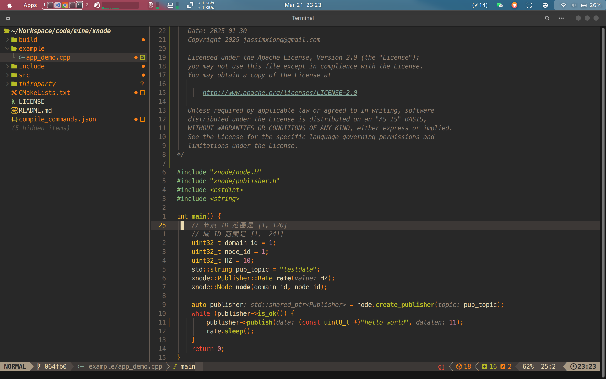

# xvim

nvim 个人配置



## 要求

- nvim > 0.10
- node.js > 20

依赖：

- fzf
- yazi
- rg\fd（nvim的fzf-lua插件需要）
- lazygit
- xsel

其他剩余的依赖，请执行 `:LazyHealth` 查看分析报告来选择安装。

## 安装

```shell
git clone https://github.com/Meha555/xvim ~/.config/nvim

rm -rf ~/.config/nvim/.git

nvim
```

运行 `nvim` 后会自动下载安装对应reversion的插件。如果下不下来，请开代理。

## 支持的语言

- c, cpp
- go
- python
- rust
- typescript
- cmake

## 插件

### 1. 界面与导航相关
- **bufferline-nvim.lua**：对应 `bufferline.nvim`，顶部缓冲区标签栏插件，显示当前打开的文件列表，支持鼠标点击切换、标签分组等，方便多文件编辑时快速导航。  
- **flash-nvim.lua**：对应 `flash.nvim`，提供高效光标跳转功能，通过输入字符匹配目标位置，支持跨窗口、跨缓冲区快速移动，替代传统的 `f/F/t/T` 等跳转。  
- **lualine-nvim.lua**：对应 `lualine.nvim`，底部状态栏插件，可显示文件类型、Git分支、光标位置、LSP状态等信息，支持高度自定义样式和组件。  
- **trouble-nvim.lua**：对应 `trouble.nvim`，集中展示LSP诊断信息（错误、警告、提示等）、Git冲突、快速修复选项等，支持过滤和快速跳转到问题位置。  


### 2. 主题与外观相关
- **catppuccin.lua**：对应 `catppuccin`，一款现代风格的颜色主题，提供多种变体（如Mocha、Macchiato），配色柔和且对语法高亮、UI元素适配良好。  
- **gruvbox-nvim.lua**：对应 `gruvbox.nvim`，经典复古风格主题，基于Vim原版 `gruvbox` 配色，色调温暖，适合长时间编码。  
- **tokyonight-nvim.lua**：对应 `tokyonight.nvim`，深色系现代主题，配色鲜明且对比度适中，对代码高亮和UI组件（如弹窗、菜单）优化较好。  
- **noice-nvim.lua**：对应 `noice.nvim`，增强Neovim的消息系统，将命令行、通知、弹窗等统一美化，支持自定义显示方式（如悬浮窗、底部条），提升交互体验。  


### 3. 代码补全与LSP相关
- **nvim-cmp.lua**：对应 `nvim-cmp`，核心代码补全引擎，支持整合多种补全源（LSP、路径、字典等），提供智能补全建议，可配置补全逻辑和样式。  
- **cmp-tabnine.lua**：对应 `cmp-tabnine`，`nvim-cmp` 的补全源插件，集成Tabnine AI补全工具，提供基于机器学习的代码建议（需联网）。  
- **copilot.lua**：对应 `copilot.lua`（或 `github/copilot.vim` 的Lua封装），集成GitHub Copilot AI助手，实时提供上下文相关的代码补全，支持多种编程语言。  
- **nvim-lspconfig.lua**：对应 `nvim-lspconfig`，LSP（语言服务器协议）配置工具，提供主流语言服务器（如Pyright、tsserver）的默认配置，简化LSP setup流程。  
- **mason-nvim.lua**：对应 `mason.nvim`，Neovim的包管理器，用于一键安装/管理LSP服务器、linters、格式化器等开发工具，无需手动配置路径。  
- **mason-lspconfig-nvim.lua**：对应 `mason-lspconfig.nvim`，连接 `mason.nvim` 和 `nvim-lspconfig` 的桥梁，自动将mason安装的LSP服务器与lspconfig关联，简化配置。  


### 4. 语法与编辑增强
- **nvim-treesitter.lua**：对应 `nvim-treesitter`，基于Tree-sitter解析器的语法工具，提供精准的语法高亮、代码折叠、增量选择、括号匹配等功能，支持绝大多数编程语言。  
- **ts-comments.lua**：可能是与 `nvim-treesitter` 配合的注释增强插件，提供语法感知的注释操作（如按语言自动调整注释符号），或增强注释的高亮/折叠。  
- **mini-ai.lua**：对应 `mini.ai`，扩展Neovim的文本对象（如 `a"`、`i(` 等），支持更多场景（如函数参数、HTML标签、正则分组）的快速选择，提升编辑效率。  
- **mini-pairs.lua**：对应 `mini.pairs`，自动补全成对符号（括号、引号、HTML标签等），如输入 `(` 自动补全 `)`，并支持跳转到配对位置。  
- **mini-icons.lua**：对应 `mini.icons`，轻量级图标库，为文件类型、Git状态、LSP诊断等提供统一图标支持，可被其他插件（如状态栏、文件浏览器）调用。  


### 5. Git相关
- **lewis6991-gitsigns-nvim.lua** / **gitsigns-nvim.lua**：均对应 `gitsigns.nvim`（作者lewis6991），在编辑器左侧显示Git变更标记（添加/删除/修改行），支持查看 blame信息、暂存/撤销变更、跳转差异等功能。  


### 6. 代码质量与调试
- **conform.lua**：对应 `conform.nvim`，代码格式化工具，整合多种格式化器（如Prettier、Black），支持自动格式化（保存时）或手动触发，配置简单。  
- **nvim-lint.lua**：对应 `nvim-lint`，代码检查工具，集成多种linters（如ESLint、flake8），实时检测代码中的语法错误和风格问题，并在编辑器中标记。  
- **nvim-dap.lua**：对应 `nvim-dap`，调试适配器协议（DAP）客户端，支持在Neovim中调试代码（设置断点、单步执行、查看变量等），需配合对应语言的DAP适配器使用。  


### 7. 实用工具与功能增强
- **persistence-nvim.lua**：对应 `persistence.nvim`，会话管理工具，自动保存当前Neovim状态（打开的缓冲区、窗口布局、光标位置等），支持重启后恢复会话。  
- **todo-comments-nvim.lua**：对应 `todo-comments.nvim`，识别代码中的 `TODO`、`FIXME`、`NOTE` 等注释标签，集中展示并支持快速跳转到对应位置，方便跟踪待办事项。  
- **markdown-preview-nvim.lua**：对应 `markdown-preview.nvim`，Markdown实时预览插件，可在浏览器或Neovim内置窗口中实时渲染Markdown内容（支持公式、图表等）。  
- **grug-far-nvim.lua**：对应 `grug-far.nvim`，高级查找替换工具，支持跨文件搜索、正则匹配、批量替换，提供交互式界面预览和确认替换结果。  
- **which-key-nvim.lua**：对应 `which-key.nvim`，快捷键提示工具，当输入部分快捷键（如 `leader` 键）后，自动显示后续可能的按键及对应命令，帮助记忆和发现快捷键。  
- **nui-nvim.lua**：对应 `nui.nvim`，UI组件库，为插件开发者提供统一的弹窗、菜单、输入框等UI元素接口，简化自定义UI的开发（许多插件依赖它实现界面）。  
- **snacks-nvim.lua**：提供一系列质量提升（QoL）插件的集合。


### 8. 其他
- **example.lua**：不是插件，是官方提供的用于参考的模板文件。  
- **lazydev-nvim.lua**：可能与 `Lazy.nvim`（插件管理器）相关，可能是辅助开发插件配置的工具（如自动生成插件配置模板）。  
